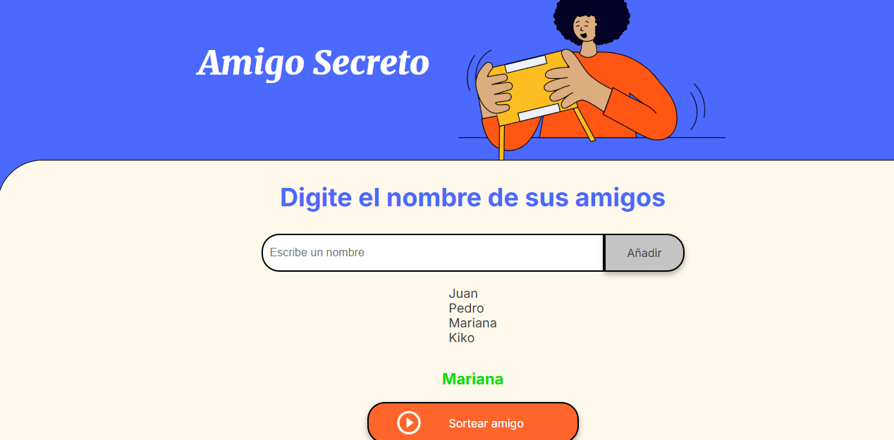

<h1 align = "center">Juego "Amigo secreto" </h1>
 
<h2 align = "center"> Funcionalidad </h2>

 La imagen de arriba es la unica immagen que es parte de este programa. Como se menciona en la descipcion, se añaden nombres y se selecciona un amigo secreto 

- En la caja de texto con el texto "Escribe nombre" se va a ingresar el nombre de la persona.   
🚧 Se esta trabajando en evitar que se lleguen a colocar tipos que no concuerdan con un nombre 🚧
- Posteriormente se selecciona el boton añadir, este boton va a ir mostrando en una lista los nombres ingresados 
 
- Posterior a seleccionar el boton "Sortear amigo" vamos a mostrar el amigo secreto seleccionado
 
 
<h2 align = "center">Descarga</h2>

La descarga de este programa se puede hacer por medio de github. Los archivos que no son "necesarios" son las imagenes. Inicio,Lista y Lista_seleccion

